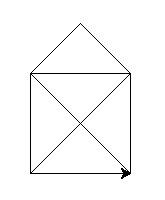

# Kommentare


Die Aufgaben Programme, die hier geschrieben werden sind immer komplexer und größer.
Je mehr man schreibt, desto schwieriger ist es den Überblick zu bewahren.
Um diesen Überblick zu vereinfachen kann man Programme kommentieren.

Man schreibt also zunächst ein "Hashtag" `#` und dann seinen Kommentar. Der Computer ignoriert alles, was nach dem Hashtag in der selben Zeile steht.

So erstellt man also Hinweise für alle menschlichen Leser ohne dass sich für den Computer das Programm ändert.

Ein Beispiel:

```python
# Das Turtlemodul aktivieren
import turtle
t = turtle.Pen()
# Ein Dreieck zeichnen:
t.forward(100) # 100 Schritte laufen
t.left(120)    # Um 120 Grad drehen. (Innenwinkel 60 Grad)
t.forward(100)
t.left(120)
t.forward(100)
t.left(120)
# Ein Viereck zeichnen
t.forward(100)
t.left(90)
t.forward(100)
t.left(90)
t.forward(100)
t.left(90)
t.forward(100)
```

Solche Kommentare sind sehr hilfreich dabei sich zu orientieren. Zum Beispiel beim Haus des Nikolaus können so die einzelnen `forward`-Befehle mit Wörtern wie "Dach", "Boden" usw. markiert werden. Soll zum Beispiel noch ein Kamin an das Haus gebaut werden, dann ist jetzt der zu verändernde `forward`-Befehl viel einfacher zu finden.

> ### Übung
> 1. Statten Sie ihr Nikolaushaus mit Kommentaren aus.
>
> 2. Speichern Sie diese Datei zusätzlich unter dem Namen `nikolaushaus-uebung-rechtwinklig.py`. Hierzu klicken sie auf "File->Save as" oder "Datei->Speichern unter"
> 2. Verändern Sie in dieser neuen Datei die Zeichnung so, dass das Dach rechtwinklig ist. Hier können Sie bemerken, dass die [Kommentarfunktion](030-kommentare.md) sehr hilfreich sein kann.
>
>    
