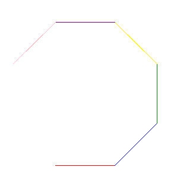

# Listen


Python kann neben einem einzelnen Wert auch eine Liste von Werten in einer Variablen abspeichern.

Ein Beispiel:

```python
a = [3,4,2,1,-155,7]
```

Die so erstellte Liste kann nun verwendet werden. Soll zum Beispiel die erste Zahl der Liste verwendet werden, so schreibt man z.B. `print(a[0])`, für die `-155`, `print(a[4])` und für die `7` Zahl `print(a[5])`

## Wiederholungen für jedes Element einer Liste

Das `for` kann auch dazu verwendet werden, etwas für jedes Element einer Liste einmal aufzurufen. Zum Beispiel so:

```python
for color in ["blue", "green", "yellow"]:
    print("A ", color, " bird")
```

Es wird also ausgegeben:
```
A blue bird
A green bird
A yellow bird
```

Natürlich kann das auch in ein turtleprogramm eingebaut werden, um zum Beispiel die Farbe zu ändern.

Mit Farben und Text ist das noch relativ uninteressant. Wenn man jedoch die Farben zum Zeichnen verwendet, gibt es plötzlich ganz schöne Ergebnisse:

```python
# Definieren der Variable farben. Diese erhält eine List mit 6 Farben.
farben = ["red", "blue", "green", "yellow", "purple", "pink"]
# Für jede der Farben zeichnet man eine Linie
for farbe in farben:
    t.color(farbe)
    t.forward(30)
    t.left(45)
```



> ### Übung
> verschönern Sie eines ihrer erstellten Mandalas mit Farben.
> ### Hinweis
> Wollen Sie die Farben wiederholen können Sie z.B. schreiben: `["red", "black"]*10`. Damit erstellen Sie eine Liste, welche immer abwechselnd `"red"` und `"black"` enthält.
