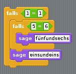

# Bedingtes ausführen

{back} {inhalt} {chapter} {next}

Alle Programmiersprachen bieten die Möglichkeit, einen Befehl nur dann auszuführen, wenn eine bestimmte Bedingung eintritt.

Ein Programm soll zum Beispiel einen bestimmten Satz nur sagen, wenn der Benutzer auf einen `turtle.textinput()` Befehl `hallo` sagt:

```python
import turtle
t = turtle.Pen()
t.shape("turtle")

antwort = turtle.textinput("Frage", "Sagen Sie hallo:")
if antwort == "hallo":
  t.write("Einen lieben Gruß", True) #(Das True bewirkt dass die Turtle beim Schreiben läuft.)
```

Ergebnis nach der Eingabe von `hallo`, wurde was anderes eingegeben, so kommt der Text nicht:


Das `if` in diesem Beispiel ist das Kommando, welches den bedingten Aufruf einleitet. Das `antwort == "hallo"` ist die Bedingung, es gibt noch viele [weitere Möglichkeiten Bedingungen zu schreiben](Bedingungen.md). Es vergleicht das, was in der Variablen `antwort` steht mit dem Wort `"hallo"` ist beides das gleiche wird die folgende Zeile ausgeführt, ist es etwas verschiedenes wird die folgende Zeile übersprungen.

Nach der Bedingung folgt immer ein **Doppelpunkt**. Die nächste Zeile wird ein Stück weiter eingerückt als das `if`.

## Kurze Bemerkung zur **Einrückung**

Python verwendet verschieden starke Einrückungen, um die Zusammengehörigkeit von Befehlen zu markieren. Ist also zum Beispiel eine Zeile nach dem `if` Befehl mehr eingerückt als das `if` selbst, so gehört diese Zeile zu diesem `if`. Einrückungen sind immer notwendig nach einem Doppelpunkt und andersherum sind Doppelpunkte immer notwendig vor Einrückungen. Auch innerhalb eines eingerückten Bereiches kann wieder ein `if` vorkommen. Der Eingerückte teil des inneren `if`s muss dann noch weiter eingerückt werden.

> ### Merke
> Immer einrücken nach einem Doppelpunkt und immer wenn `Thonny` nicht automatisch einrückt, wo es eigentlich einrücken sollte, fehlt davor ein Doppelpunkt.

Beispiel:

```python
import turtle
t = turtle.Pen()
freitag = turtle.textinput("Frage", "Sagen Sie einen Tag:")
note = turtle.textinput("Frage", "Geben Sie eine Note für diesen Tag:")
if freitag == "Montag":
  if note == "6":
     t.write("Falsch Montage sind die Besten! ", True)
     note = "1"

t.write(freitag + " mit Note " + note + " stimme ich zu! Viel Spass!")
```

> In einer ganz anderen, grafischen Programmiersprache `scratch` wird ein if als "Klammer" dargestellt.
> Dieses Bild ist nur, falls Sie sich das dann besser vorstellen können. Falls nicht ignorieren Sie es.
> 
> Das `if`, welches zu falls übersetzt wird, ist eine Klammer. Alles was innerhalb dieses `if`s ist, wird nur ausgeführt, wenn die Bedingung des `if`s zutrifft. Dieses "innerhalb" wird in Python durch "stärker eingerückt", also mehr Leerzeichen am Anfang der Zeile deutlich gemacht. Natürlich kann auch innerhalb eines `if`s ein zweites `if` stehen.

## Wenn → Dann → Ansonsten

Oft wird es benötigt, dass ein bestimmter Befehl ausgeführt wird, wenn eine Bedingung zutrifft, ansonsten ein anderer Befehl. Der Befehl hierzu ist `else`. Auch auf `else` folgt ein Doppelpunkt und weitere eingerückte Befehle.

> Notiz: Sowohl nach `if` als auch nach `else` muss mindestens ein eingerückter Befehl kommen. Also man kann  im folgenden Beispiel **keines** der beiden `write`s weglassen (man kann sie aber durch beliebige andere Befehle ersetzen).

```python
import turtle
t=turtle.Pen()
gru = turtle.textinput("Frage", "Geben Sie ein Grußwort ein:")
if gru == "Guten Tag":
   t.write("Ich antworte mit Hallo")
else:
   t.write("Bah! - zu unfreundlich!")
```

Logischerweise ist `else` nur nach einem fertigen `if` sinnvoll.

Man sieht hier, dass dem Computer die Bedeutung der Worte völlig gleichgültig ist, er folgt nur der Logik der Befehle. Sie können das freundlichste Grußwort eingeben, wenn es aber nicht "Guten Tag" ist, wird der Computer das unfreundlich finden.


# Ein Grußprogramm mit drei Möglichkeiten

Ein Programm, das auf `hallo` und `tschüss` unterschiedlich reagiert:

```python
import turtle
t=turtle.Pen()

gru = turtle.textinput("Frage", "Geben Sie ein Grußwort ein:")
if gru == "hallo":
     t.write("Guten Tag")
elif gru == "tschüss":
     t.write("Auf Wiedersehen")
else:
     t.write("Ich habe Sie leider nicht verstanden")
```
In diesem Beispiel wird eine weitere Option der `if`-Ausdrücke verwendet: `elif`. Dieses steht für `else if` und bedeutet: Falls nicht die erste Bedingung dann vielleicht diese Bedingung also am ehesten zu übersetzen mit "oder wenn". Zwischen einem `if` und einem `else` können beliebig viele `elif` stehen, aber vorher muss immer ein `if` und stehen.

Dies wird in die Datei `gru.py` gespeichert.

> ### Übung Grußprogramm
> Schreiben und testen Sie ein Programm, welches nach einem Gruß fragt und je nach Gruß unterschiedlich reagiert.

> Speichern Sie dieses Programm unter dem Namen `gru.py`.

## Beispiel: ein "Passwortprogramm"

Die nun  gestellte Aufgabe ist es ein Passwort zu erraten, welches im Programm festgelegt wird. Zunächst speichern wir das zu erratende Passwort in einer Variablen.
```python
geheim = "Döner"
```
Es werden drei Versuche gegeben das Passwort zu erraten unter Verwendung des Eingabe-Befehls aus dem vorherigen Abschnitt:
```python
geheim = "Döner"

import turtle
t=turtle.Pen()

if geheim == turtle.textinput("Frage", "Versuch Nummer 1:"):
    t.write("geschafft")
else:
    if geheim == turtle.textinput("Frage", "Versuch Nummer 2:"):
        t.write("geschafft")
    else:
        if geheim == turtle.textinput("Frage", "Versuch Nummer 3:"):
            t.write("geschafft")
        else:
            t.write("nicht geschafft")
```

Dieses Programm ist natürlich nicht so, wie der Computer ein Passwort abfragen würde, da das Passwort für jeden lesbar im Programm steht. Normalerweise wird das Passwort nur verschlüsselt also nicht lesbar abgespeichert.

> ### Übung Passwortprogramm
>
> Schreiben Sie ein Programm, welches drei Versuche gewährt ein Passwort zu erraten. Speichern Sie dieses Programm in der Datei `passwort.py`.
>


> ### Übung Zahlenratespiel
> Schreiben Sie ein Programm, welches 3 Versuche gewährt eine Zahl zu erraten. Dieses Programm kann sehr ähnlich zu dem Grußprogramm geschrieben werden.
> Speichern Sie dieses Programm unter `ratemal.py`.
>
> Gehen Sie schrittweise vor:
> 1. Schreiben Sie ein Programm, welches nach einer Zahl fragt und diese ausgibt.
> 2. Testen Sie das Programm ob es tut was es soll.
> 3. Entfernen Sie die Ausgabe, und fügen Sie stattdessen ein `if` und `else` ein, welches auf die Eingabe reagiert.
>> Vorsicht beim Vergleichen: das Zeichen einer Zahl ist nicht gleich der Zahl. Zum Beispiel ist `"2" == 2` unwahr also `False`. Um diese beiden Werte sinnvoll zu vergleichen, muss das Zeichen `"2"` zur Zahl `2` konvertiert werden: `int("2") == 2` ([mehr](Datentypen.md#umwandlung-von-datentypen)).

{back} {inhalt} {chapter} {next}
