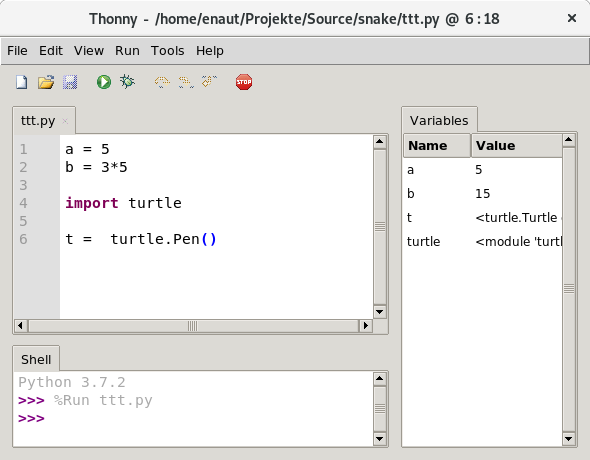

# Variablen

{back} {inhalt} {chapter} {next}

In diesem Kapitel geht es darum, wie sich das Computerprogramm etwas "merkt", und wie man dieses gemerkte dann wieder verwenden kann.


Wenn ein Wert an zwei Stellen im Programm verwendet werden soll, also zum Beispiel um  die Mitternachtsformel einmal mit plus und einmal mit minus zu rechnen, so muss der Wert zwischengespeichert werden. Hierzu werden Variablen verwendet. Um eine Variable zu erstellen, schreibt man einen beliebigen Namen der Variablen (ohne Leerzeichen) und danach ein `=`  gefolgt von dem Wert den die Variable haben soll.

Einige Beispiele:
```python
x = 5
y = 'hallo'
z = 5 + 5
```

In der ersten Zeile wird die Zahl `5` in die Variable `x` eingespeichert. Die zweite Zeile speichert `'hallo'` in `y`. Die Dritte das Ergebnis der Berechnung `5 + 5` in `z`.

Die Zuweisung einer Variable hat keinerlei Ausgabe - es wird also nirgends sichtbar, dass diese Variable jetzt gesetzt ist.

> ### Hinweis
> möchte man die vorhandenen Variablen sehen, kann man eine Anzeige an der rechten Seite aktivieren. Hierzu klickt man auf `View`→`Variables`. Die definierten Variablen sind dann nach einem klick auf den Play-Button sichtbar:
> 

Diese Variablen können nun verwendet werden hat man zum Beispiel mit `x = 5` der Variablen `x` den Wert `5` gegeben, so kann man nun statt der dritten Zeile auch `z = x + x` schreiben und wird wieder in `z` denselben Wert (`10`) gespeichert haben. Möchte man den Wert einer Variablen ausgeben, so kann man dies mit `print` tun. Um den Wert von `z` zu erfahren also `print(z)`.

Die Variablen sind so etwas wie das Kurzzeitgedächtnis des Computers... Er kann sich alles darin merken, aber nach Ende des Programms sind alle Variablen weg. Das speichern ist also nicht dauerhaft (Fachwort: persistent).

> ### Übungen
>
>  1. Erstellen Sie eine Python-Datei `Variablen.py` welche den Variablen `x, y, z` die Werte `34, 24, 'hallo'` zuweist.
>  1. Führen Sie das Programm aus. Es erscheint keine Ausgabe, da `python` beim Variablen erstellen keine Ausgabe anzeigt.
>  5. Betrachten Sie die erstellten Variablen im "`Variables View`", indem Sie auf `View`→`Variables` klicken.
>  1. Lassen Sie das turtle alle Variablen sagen mit `t.write(variable, True)`. Achtung Geben Sie die Variablen aus und nicht nur die selbe Zahl.
>  1. Testen Sie, indem Sie das Programm nochmals starten, ihre neue Ausgabe.
>  2. Berechnen Sie in die Variable `summe` die Summe von `x` und `y`. Verwenden Sie auch hier die Variablen statt ihren Zahlenwert.
>  3. Geben Sie die Summe mit `t.write` aus.
>  4. Starten Sie das Programm erneut lösen Sie alle [Fehlermeldungen](Fehler.md).

{back} {inhalt} {chapter} {next}
